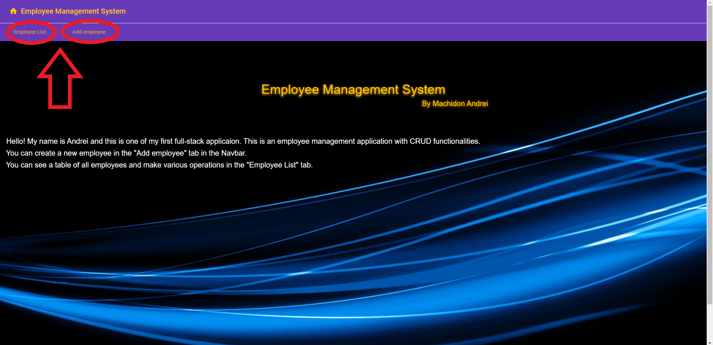
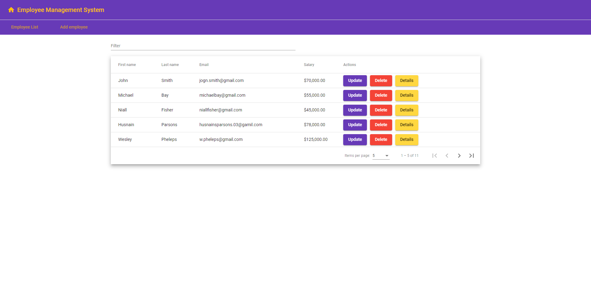
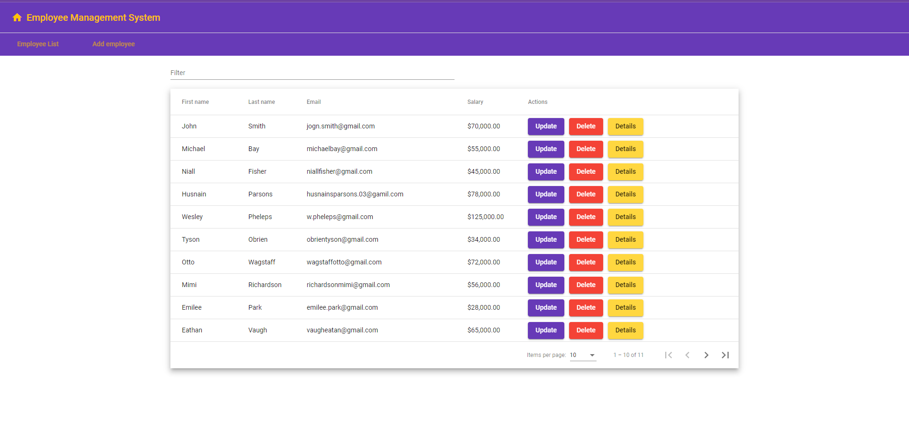
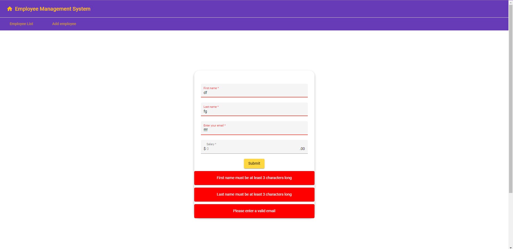

# Employee-management-system
This is my first full-stack application using Spring Boot and Angular. In this application, you can create, update, delete, and see details of all employees from a MySql database.

The landing page is simple.From there, you have 2 tabs:
 
•Employee List where you can see a list of all employees
 
•Add employee where you can create a new employee.
 

 
In the Employee List tab, you can see a table of all the employees from the database.Here you can see details like the first name, last name, email and salary.  This table has mutliple featrues like Filter Search Bar or Pagination.
 

 
In the Add Employee Tab there is a form where you can create a new Person which will be atuoamatically transfered to the database.
 

 
Also, the Angular Form Component uses form validation, so you can't upload a form without information to the database;

